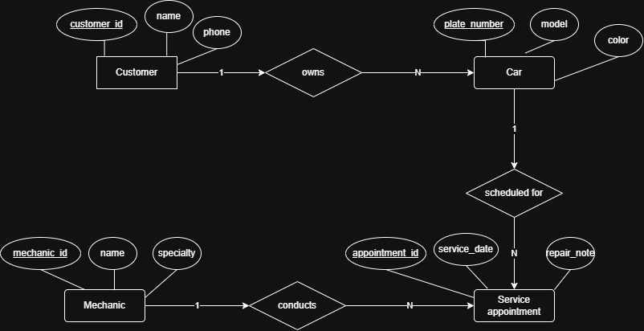

# INFOMAN1 – Week 2 Lab: Conceptual ERD Case Study
**Name:** [OBIEFULE DECLAN]
**Student ID:** [2510223]
**Section:** [CCSE]

## Task 1 — Candidate Entities

| Entity | Justification |
|---|---|
| Customer | The scenario mentions "The shop has many customers," making them as primary users who own cars and bring them in for service. |
| Car | The scenario states "each customer may bring in one or more cars," making Car a distinct object with its own specific properties like model, color, and plate number. |
| Mechanic | The scenario explicitly states "The shop employs several mechanics," representing staff members with specific properties like name and specialty who perform repairs. |
| Service Appointment | The scenario notes "a mechanic works on it during a scheduled service appointment," representing a discrete event that tracks when repairs occur, repair notes, and links cars to mechanics. |

## Task 2 — Attributes per Entity

### Customer
- Primary Key: customer_id
- Attributes:
  - customer_id — Domain: integer, unique auto-increment identifier
  - name — Domain: text string
  - phone_number — Domain: text string (numeric string format)

### Car
- Primary Key: plate_number
- Attributes:
  - plate_number — Domain: text string (alphanumeric, unique license plate)
  - model — Domain: text string
  - color — Domain: text string

### Mechanic
- Primary Key: mechanic_id
- Attributes:
  - mechanic_id — Domain: integer, unique staff ID
  - name — Domain: text string
  - specialty — Domain: text string (e.g., engine, brakes, electrical)

### Service Appointment
- Primary Key: appointment_id
- Attributes:
  - appointment_id — Domain: integer, unique transaction ID
  - service_date — Domain: date/datetime
  - repair_note — Domain: text string

## Task 3 — Relationships

| Relationship (verb phrase) | Between | Cardinality | Checked both directions? |
|---|---|---|---|
| owns | Customer ↔ Car | 1:N | Yes — one customer can own many cars, but according to the scenario, each car belongs to exactly one customer. |
| scheduled for | Car ↔ Service Appointment | 1:N | Yes — one car can have many service appointments over time, but each specific service appointment is scheduled for exactly one car. |
| conducts | Mechanic ↔ Service Appointment | 1:N | Yes — one mechanic works on many service appointments, but each specific scheduled appointment is conducted by one assigned mechanic. |

## Task 4 — Conceptual ERD

