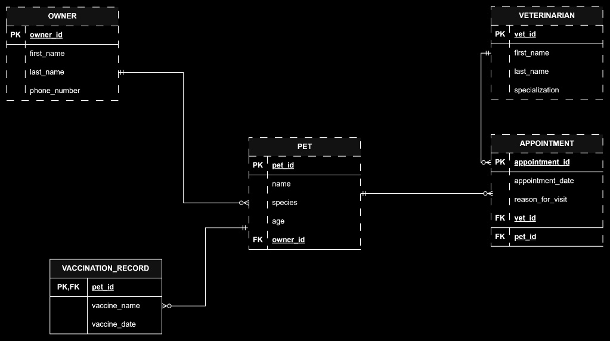

# INFOMAN1 — Week 3 Lab Answers

## Task 1 — Classify Attributes and Identify Weak Entities

Composite Attribute:
full name(for both pet owner and veterinarian)

Multivalued Attribute:
vaccination records

Derived Attribute:
age(pet)

Vaccination Records is a weak entity. A weak entity is an entity that lacks its own primary key and depends on a strong (owner) entity for identification and existence. Vaccination Records relies on the **pet** entity for identification. Its primary key combines the parent's key (`pet_id`) with its own partial key (`vaccine_name` or `vaccination_date`).

## Task 2 — Specify Participation Constraints

1. Owner – Pet
Owner to Pet: O| (Zero or Many/Optional Many)
Scenario Evidence: "A pet owner... is not required to have any pets on file at a given time..." (Optional, inner symbol O; Many, outer symbol |<).

Pet to Owner: || (Mandatory One)
Scenario Evidence: "...every pet must belong to exactly one owner." (Mandatory, inner symbol |; One, outer symbol |).

Crow's Foot Notation: Owner (1) ------ (0..N) Pet

2. Veterinarian – Appointment
Veterinarian to Appointment: O| (Zero or Many/Optional Many)
Scenario Evidence: "A veterinarian... can conduct multiple appointments over time or none at all." (Optional, inner symbol O; Many, outer symbol |<).

Appointment to Veterinarian: || (Mandatory One)
Scenario Evidence: "Every appointment record... must specify exactly one veterinarian..." (Mandatory, inner symbol |; One, outer symbol |).

Crow's Foot Notation: Veterinarian (1) ------ (0..N) Appointment

3. Pet – Appointment
Pet to Appointment: O| (Zero or Many/Optional Many)
Scenario Evidence: A pet can be registered in the system without having an appointment yet, or it can have multiple appointments over time (Optional, inner symbol O; Many, outer symbol |<).

Appointment to Pet: || (Mandatory One)
Scenario Evidence: "Every appointment record... must specify... exactly one pet—an appointment cannot exist without both." (Mandatory, inner symbol |; One, outer symbol |).

Crow's Foot Notation: Pet (1) ------ (0..N) Appointment

4. Pet – Vaccination Record
Pet to Vaccination Record: O| (Zero or Many/Optional Many)
Scenario Evidence: "...a pet may have zero, one, or several vaccination records..." (Optional, inner symbol O; Many, outer symbol |<).

Vaccination Record to Pet: || (Mandatory One)
Scenario Evidence: "...each vaccination record only makes sense in relation to the specific pet it belongs to..." (Mandatory, inner symbol |; One, outer symbol |).

Crow's Foot Notation: Pet (1) ------ (0..N) Vaccination Record

## Task 3 — Build the Logical ERD

## Task 4 — Translate to Relational Schema Notation
owner (owner_id, first_name, last_name, phone_number)

pet (pet_id, name, species, age, owner_id*)

Note: owner_id references owner(owner_id)

veterinarian (vet_id, first_name, last_name, specialization)

appointment (appointment_id, appointment_date, reason_for_visit, vet_id*, pet_id*)

Note: vet_id references veterinarian(vet_id)

Note: pet_id references pet(pet_id)

vaccination_record (pet_id*, vaccine_name, vaccination_date)

Note: pet_id references pet(pet_id)

## Task 5 — Key Justification & Schema Validation
## 1. Key Justifications

### `owner` Table — Choice of Surrogate Key (`owner_id`)
* **Justification:** A surrogate key (`owner_id`) was selected instead of a natural key (such as `phone_number` or a combination of `first_name` and `last_name`). Full names are not guaranteed to be unique across a clinic's client base, and phone numbers can change over time or be shared among family members residing in the same household. A system-generated surrogate key guarantees uniqueness, immutability, and efficient indexing across the database.

---

### `vaccination_record` Table — Choice of Composite Key (`pet_id`, `vaccine_name`, `vaccination_date`)
* **Justification:** A composite key containing the foreign key `pet_id` (referenced from the parent `pet` entity) along with partial keys (`vaccine_name`, `vaccination_date`) was chosen because `vaccination_record` is a **weak entity**. It lacks identification independence and only exists relative to a specific pet. Combining these three attributes ensures that a single pet cannot have the exact same vaccine logged twice on the exact same date while eliminating the need for an unnecessary surrogate key on a dependent weak entity.

---

## 2. Line-by-Line Schema Validation

| Scenario Requirement | Line / Rule in Scenario | Schema Implementation & Mapping Verification |
| :--- | :--- | :--- |
| **Pet Owner Attributes & Key** | *"identified by an owner ID, full name (consisting of first name and last name), and phone number"* | Represented in `owner` entity with attributes `owner_id` (PK), `first_name`, `last_name`, and `phone_number`. |
| **Owner-Pet Participation** | *"...not required to have any pets on file at a given time, but every pet must belong to exactly one owner."* | Represented by foreign key `owner_id` in `pet` table marked as mandatory (`NOT NULL`). |
| **Pet Attributes & Key** | *"A pet has a pet ID, name, species, and age."* | Represented in `pet` entity with attributes `pet_id` (PK), `name`, `species`, and `age`. |
| **Appointment Details & Constraints** | *"Every appointment record tracks an appointment ID, appointment date, and reason for visit, and it must specify exactly one veterinarian and exactly one pet—an appointment cannot exist without both."* | Represented in `appointment` entity with `appointment_id` (PK), `appointment_date`, `reason_for_visit`, and mandatory foreign keys `vet_id` (FK, `NOT NULL`) and `pet_id` (FK, `NOT NULL`). |
| **Veterinarian Details & Constraints** | *"A veterinarian, identified by a vet ID, full name, and specialization, can conduct multiple appointments over time or none at all."* | Represented in `veterinarian` entity with `vet_id` (PK), `first_name`, `last_name`, and `specialization`. Optional participation modeled on the `appointment` side. |
| **Vaccination History Weak Entity** | *"...tracks each pet's vaccination history, consisting of a vaccine name and vaccination date... each vaccination record only makes sense in relation to the specific pet it belongs to..."* | Represented as `vaccination_record` with a composite primary key (`pet_id`, `vaccine_name`, `vaccination_date`), where `pet_id` acts as both part of the primary key and foreign key referencing `pet(pet_id)`. |

## Self-Check

- [ ] All tasks committed with individual, meaningful commit messages
- [ ] All files placed inside `week3/`
- [ ] This file completed `answers.md`
- [ ] Repository link pasted into Moodle (no files uploaded)
