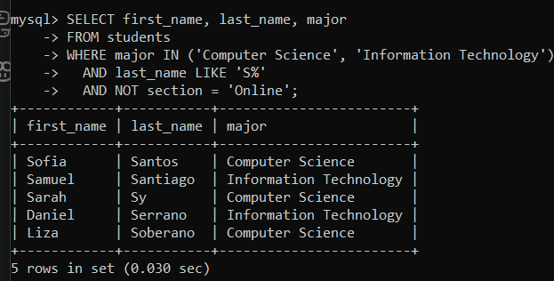
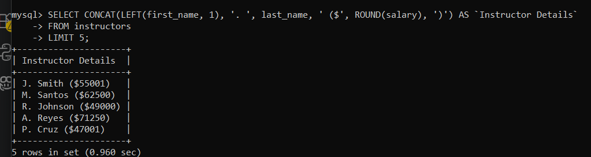
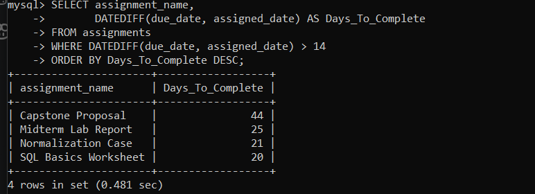
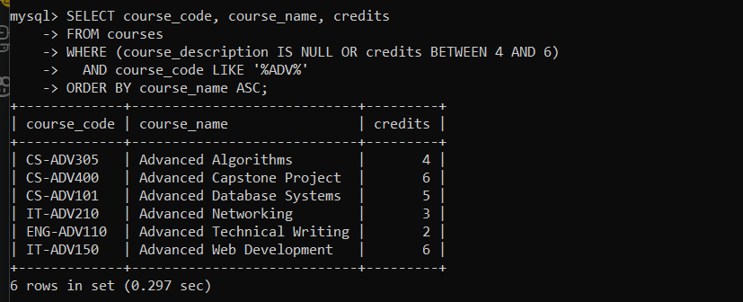

# INFOMAN1 — Week 7 Lab Answers


## Task 1 — Complex Student Roster

**Approach / explanation:**
I combined three conditions in the WHERE clause using AND so all criteria had to be met. I used IN to match both target majors, LIKE 'S%' to find last names starting with S, and NOT section = 'Online' to exclude online students. This cleanly filtered out anyone who didn't fit all three requirements.

**Code / query used (if applicable):**
```sql
SELECT first_name, last_name, major
FROM students
WHERE major IN ('Computer Science', 'Information Technology')
  AND last_name LIKE 'S%'
  AND NOT section = 'Online';
```

**Evidence (screenshot filename, output, or file reference in this folder):**


**Reflection question:**
Why is it often better to use the `IN` operator rather than chaining multiple `OR` conditions when filtering by a specific list of values?
_[Your answer here]_
Using IN keeps the code cleaner and less messy than writing multiple OR statements. It also helps prevent logical errors with parentheses and lets the database search through values faster.

---

## Task 2 — Formatting Employee Data

**Approach / explanation:**
I used CONCAT to merge the instructor's details into a single Instructor Details column. I extracted the first initial using LEFT(first_name, 1) and rounded their pay with ROUND(salary). Lastly, I used LIMIT 5 to restrict the output to the first five rows.

**Code / query used (if applicable):**
```sql
SELECT CONCAT(LEFT(first_name, 1), '. ', last_name, ' ($', ROUND(salary), ')') AS `Instructor Details`
  FROM instructors
  LIMIT 5;
```

**Evidence (screenshot filename, output, or file reference in this folder):**



**Reflection question:**
How do string functions like `CONCAT` affect the performance of a query compared to retrieving raw columns and formatting them in the application layer (e.g., in Java or Python)?
_[Your answer here]_
Running string functions in SQL wastes database CPU on formatting instead of fast data fetching. Formatting raw columns in Java or Python offloads that work to the application layer.

---

## Task 3 — Project Deadline Analysis

**Approach / explanation:**
I calculated the days between dates using DATEDIFF and aliased it as Days_To_Complete. I filtered for durations over 14 days using a WHERE clause. Finally, I sorted the results from longest to shortest with ORDER BY ... DESC.

**Code / query used (if applicable):**
```sql
SELECT assignment_name,
       DATEDIFF(due_date, assigned_date) AS Days_To_Complete
FROM assignments
WHERE DATEDIFF(due_date, assigned_date) > 14
ORDER BY Days_To_Complete DESC;
```

**Evidence (screenshot filename, output, or file reference in this folder):**


**Reflection question:**
Why is column aliasing particularly important when using mathematical or date functions in the `SELECT` clause?
_[Your answer here]_
Without an alias, MySQL displays raw formula code as the column header. Aliasing gives calculated fields clean, readable names that are easy for users and code to understand.

---

## Task 4 — Comprehensive Data Audit

**Approach / explanation:**
I grouped the IS NULL and BETWEEN checks in parentheses so either rule could pass. I then required LIKE '%ADV%' using AND so all results contained 'ADV'. Lastly, I sorted the output alphabetically using ORDER BY course_name ASC.

**Code / query used (if applicable):**
```sql
SELECT course_code, course_name, credits
FROM courses
WHERE (course_description IS NULL OR credits BETWEEN 4 AND 6)
  AND course_code LIKE '%ADV%'
ORDER BY course_name ASC;
```

**Evidence (screenshot filename, output, or file reference in this folder):**


**Reflection question:**
Explain how MySQL evaluates the expression `A OR B AND C`. How did you use parentheses (if you did) to ensure your query filtered the exact data requested in the instructions?
_[Your answer here]_
MySQL processes AND before OR, evaluating A OR B AND C as A OR (B AND C). Grouping (A OR B) in parentheses forces that check first so AND C applies to the whole result.

---

## Self-Check

- [ ] All tasks committed with individual, meaningful commit messages
- [ ] All files placed inside `week07/`
- [ ] This file completed and renamed `answers.md`
- [ ] Repository link pasted into Moodle (no files uploaded)
